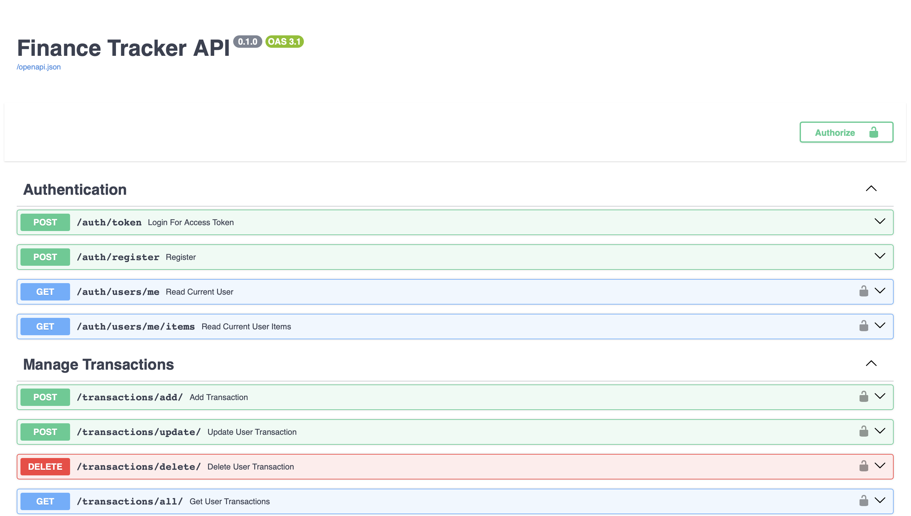
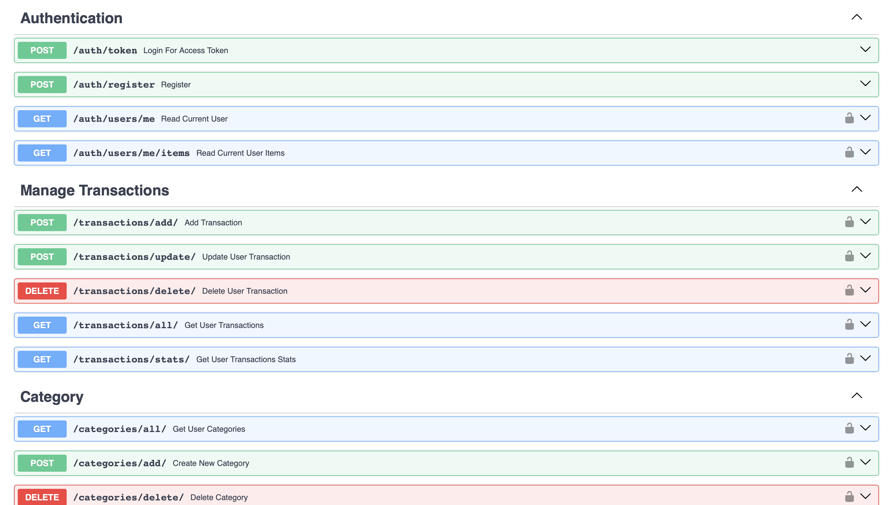

# Finance Tracker API

REST API for managing personal finances built with FastAPI and PostgreSQL.

## Features

- JWT authentication
- User registration/login
- Transaction management
- Categories
- Protected routes
- PostgreSQL database
- Pytest testing
- Docker support
- Render deployment

## Deployment link
- https://finance-tracker-api-2-m62f.onrender.com/docs

## Tech Stack

- Python
- FastAPI
- SQLAlchemy
- PostgreSQL
- Pytest
- Docker

## Swagger Documentation




## Installation

```bash
git clone <repo>
cd finance_tracker_api
pip install -r requirements.txt
```

## Environment Variables

Create `.env`:

```env
DATABASE_URL=...
SECRET_KEY=...
ALGORITHM=HS256
ACCESS_TOKEN_EXPIRE_MINUTES=30
```

## Run locally

```bash
uvicorn app.main:main_app --reload
```

## Run tests

```bash
PYTHONPATH=. pytest -v
```

## API Documentation

Swagger UI:

```text
/docs
```

## Deployment

Deployed on Render.

## Author

Vladislav Ponomaryov
